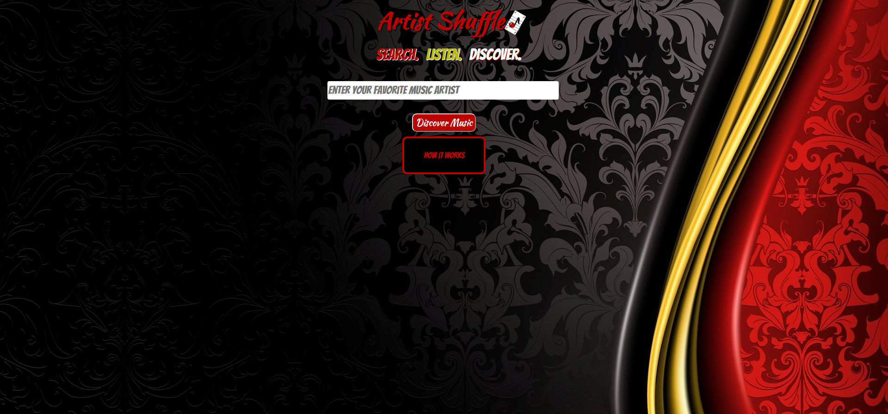
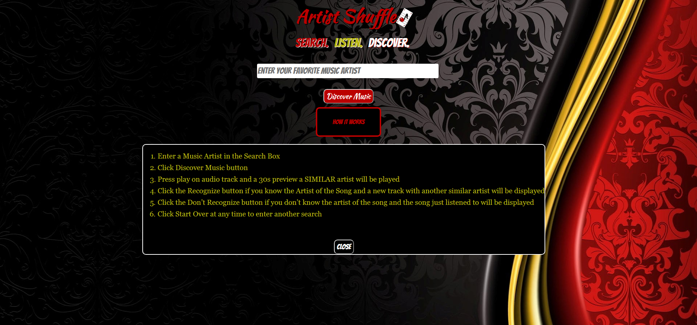
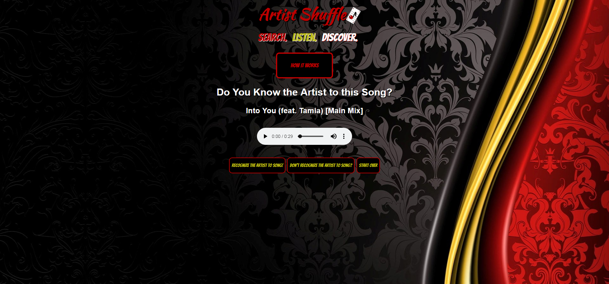
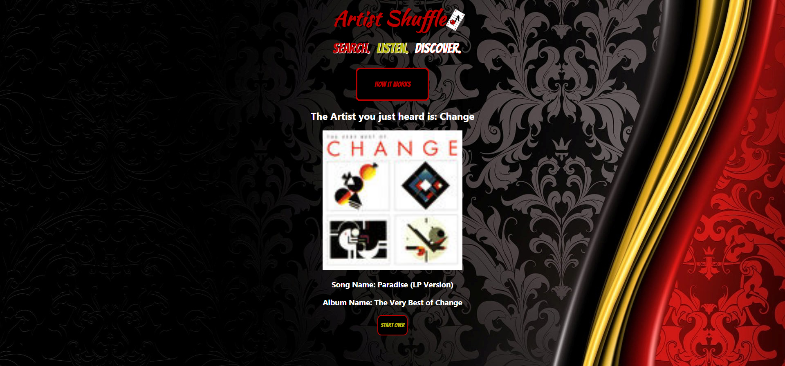

# Artist Shuffle
The app gives a hands-on approach to discovering similar music artist to a music artist you are familiar with.  
Enter a music artist in the search engine and listen to 30 second clips of similar artist. If you recognize the song after hearing the clip, another clip will be produced. If you don’t recognize the clip, information about the song you just heard will be displayed. 

## Screenshots
Home Page

Home Page with Instructions

Listen Page and Choice

Page with Results

## Demo 
- [Live Demo](https://jnewby91.github.io/ArtistShuffle/)

## Technology Used 
HTML/CSS/JavaScript/jQuery
